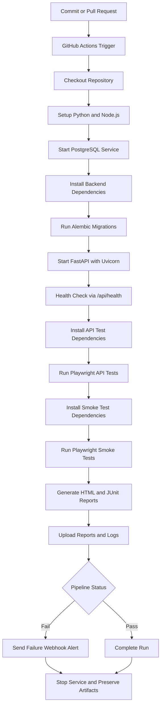
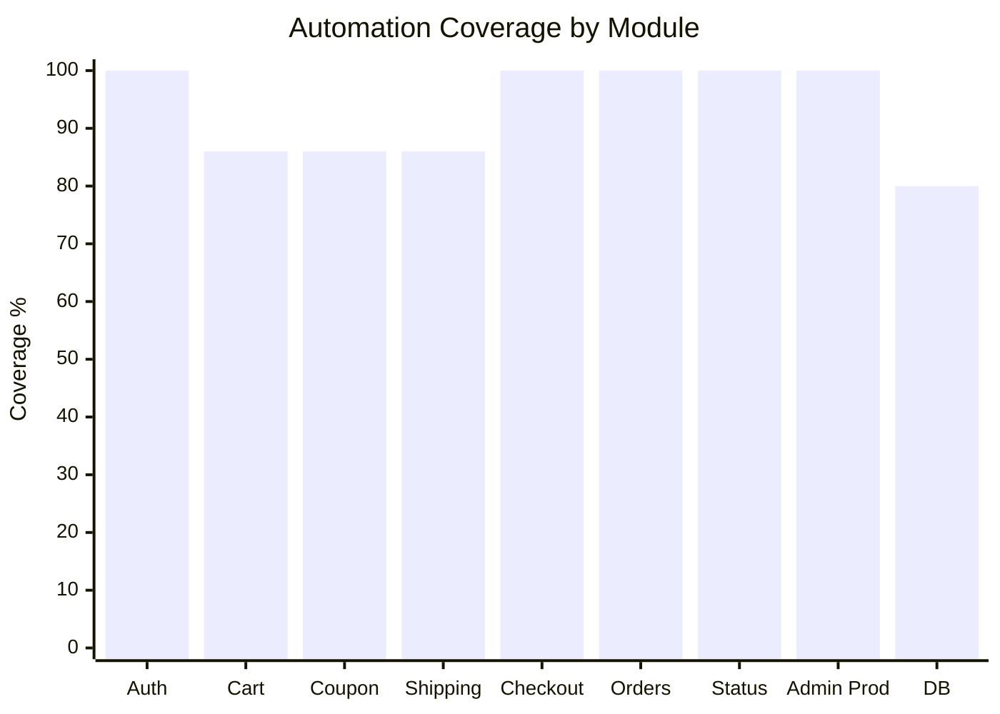
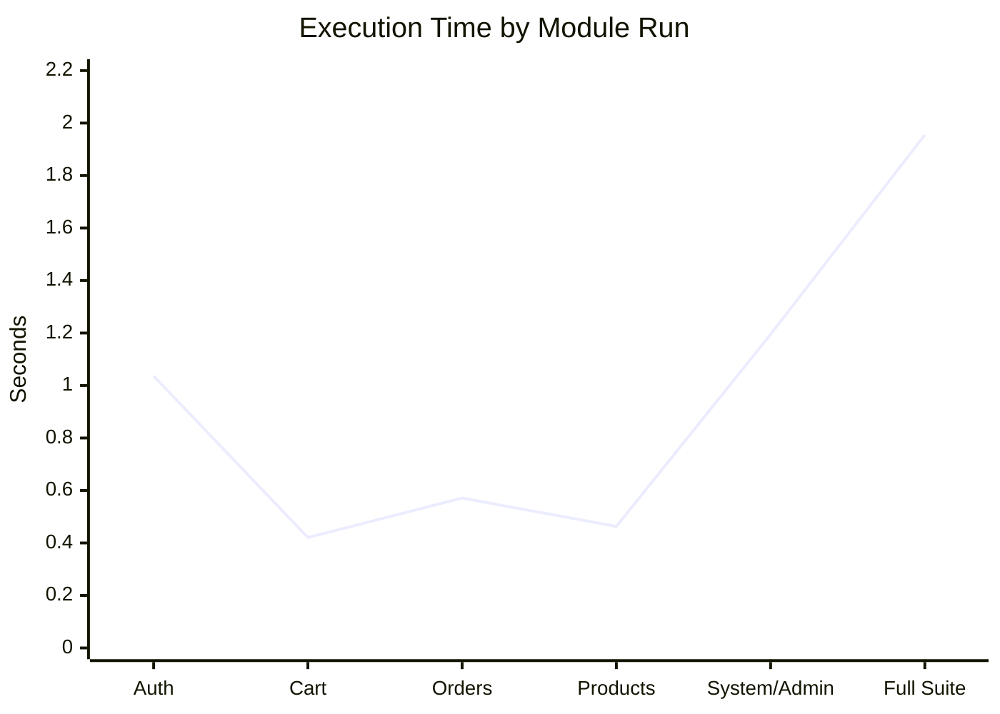

# QA Test Strategy Document

## Assignment 2

**Project:** NovaCart  
**Document Type:** QA Test Strategy  
**Group Name:** CSE-2506M  
**Team Members:**  
- Medet Akhmetov  
- Sultangali Kozhanov  
- Alisher Temirkhan  
**Repository:** `/Users/marioscordia/Desktop/qualityassurance`  
**Prepared From:** Existing strategy sections, saved evidence, logs, and generated metrics artifacts  
**Date:** 2026-04-03

---

## Table of Contents

1. [Document Overview](#1-document-overview)
2. [Automation Approach & Tool Selection](#2-automation-approach--tool-selection)
3. [Quality Gate Definitions](#3-quality-gate-definitions)
4. [CI/CD Integration Overview](#4-cicd-integration-overview)
5. [Initial Results & Coverage Metrics](#5-initial-results--coverage-metrics)
6. [Reproducibility Evidence](#6-reproducibility-evidence)
7. [Conclusion](#7-conclusion)

## 1. Document Overview

This document consolidates the Assignment 2 QA strategy outputs for NovaCart into a single deliverable. It brings together the automation approach, tool-selection rationale, quality gates, CI/CD design, initial execution results, charts, and reproducibility evidence already generated in the repository.

The project under test is a demo commerce platform with a FastAPI backend, PostgreSQL persistence, token-based authentication, and a React frontend. The focus of this strategy is risk-based automation of the most business-critical paths: authentication, cart and checkout behavior, order handling, admin operations, and supporting health or persistence checks.

## 2. Automation Approach & Tool Selection

Automation follows a risk-based strategy first, then expands into repeatable regression coverage and selected end-to-end validation. The highest-priority business paths are automated before lower-risk utility features, with the first focus placed on authentication, cart behavior, checkout, order creation, admin product control, and database-backed transaction integrity. Once those flows are stable, the same suite acts as a regression safety net in CI, while the browser smoke layer confirms that the deployed UI can still execute core user journeys against the running application.

The primary automation framework is **Playwright**. It is used in two ways in this repository: direct API automation under [`tests/`](/Users/marioscordia/Desktop/qualityassurance/tests) and browser smoke coverage under [`postman/`](/Users/marioscordia/Desktop/qualityassurance/postman). Playwright was selected because it supports both API and browser testing in one ecosystem, produces HTML and JSON/JUnit-friendly reports, integrates cleanly with GitHub Actions, and reduces framework sprawl for a project that needs fast setup and maintainable evidence collection.

As an alternative, **Postman/Newman** could cover API regression effectively, but it is less suitable when the suite needs shared TypeScript helpers, richer assertion logic, tighter source control over test code, and a direct path from API checks to browser-based end-to-end coverage. For browser automation, **Cypress** is a reasonable alternative, but Playwright is a better fit here because the project already uses it successfully for API tests and because its headless CI support, parallel execution model, and unified reporting simplify maintenance.

The automation scope covers the high-risk and medium-risk modules already identified in the risk assessment: authentication, authorization, cart operations, coupon and shipping logic, checkout and order creation, order management, inventory behavior, admin product CRUD, pricing validation, database transaction behavior, health checks, input validation, and browser smoke coverage for the customer and admin interface.

Scripts are kept modular and reusable through a helper-based design. Shared request behavior is centralized in [`api-client.ts`](/Users/marioscordia/Desktop/qualityassurance/tests/helpers/api-client.ts), which wraps Playwright's `APIRequestContext` and standardizes authentication, request construction, and common actions such as login, cart setup, and product creation. Reusable factories and seed references are centralized in [`test-data.ts`](/Users/marioscordia/Desktop/qualityassurance/tests/helpers/test-data.ts) so that test data remains unique, deterministic, and easy to update. Test specs are grouped by module folder, which keeps failures traceable to business areas and supports selective regression execution. For the browser layer, the same modular principle should continue through a Page Object Model or equivalent page abstraction as UI coverage expands beyond smoke testing.

## 3. Quality Gate Definitions

The quality gates below define the minimum conditions required for the automated suite to be considered release-ready. Observed results are based on the existing saved evidence; no tests were rerun for this document.

| Quality Gate ID | Metric | Threshold | Observed Results | Notes |
|---|---|---|---|---|
| QG-001 | Automation coverage across high-risk functions | `>= 80%` | `92%` overall automation coverage (`23/25` high-risk functions automated) | Pass. Coupon removal and explicit migration validation remain uncovered. |
| QG-002 | Critical defects in release candidate | `0` allowed | Not met; unresolved failures remain in critical-path modules, including authentication and checkout-related coverage | Fail. Gate remains blocked pending defect triage and verified fixes. |
| QG-003 | Test execution time per module | `<= 10 minutes/module` | Slowest observed module was `System/Admin` at `1.195 sec` total | Pass. Current runtime is well below the threshold. |
| QG-004 | Regression success rate | `100%` pass with `0` failed tests | Full API suite: `37 passed`, `20 failed`, `53 did not run`; browser smoke suite: `10/10 passed` | Fail. Smoke coverage passed, but the API regression baseline is not clean. |
| QG-005 | Linting and static analysis | `100%` pass with `0` high-severity findings | No recorded linting or static-analysis evidence in the current artifact set | Fail. A dedicated lint/static-analysis CI stage is still missing. |

Interpretation:

- `QG-001` passed because high-risk automation coverage exceeded the minimum threshold.
- `QG-002` failed because failures remain in business-critical workflows, so release readiness is blocked.
- `QG-003` passed because runtime is comfortably within the CI feedback target.
- `QG-004` failed because the main API suite is not yet a clean regression signal.
- `QG-005` failed because there is no preserved lint/static-analysis evidence yet.

## 4. CI/CD Integration Overview

The CI/CD implementation for NovaCart is defined in [`github-actions-ci.yml`](/Users/marioscordia/Desktop/qualityassurance/github-actions-ci.yml). It is intended for GitHub Actions execution once placed under `.github/workflows/`. The pipeline is triggered on `push` to `main` or `master`, on every `pull_request`, and manually through `workflow_dispatch`.

### 4.1 Pipeline Flow

1. Checkout repository source with `actions/checkout@v4`.
2. Provision Python `3.13` with `actions/setup-python@v5`.
3. Provision Node.js `20` with `actions/setup-node@v4`.
4. Start PostgreSQL as a service container.
5. Install backend dependencies from `requirements.txt`.
6. Apply schema migrations with `alembic upgrade head`.
7. Start FastAPI with Uvicorn in the background.
8. Poll `/api/health` with `curl`.
9. Install API test dependencies in [`tests/`](/Users/marioscordia/Desktop/qualityassurance/tests).
10. Run Playwright API tests with HTML and JUnit reporting.
11. Install browser smoke dependencies in [`postman/`](/Users/marioscordia/Desktop/qualityassurance/postman).
12. Install Chromium and run Playwright smoke tests with HTML and JUnit reporting.
13. Upload reports and logs as CI artifacts.
14. Send a webhook alert on failure if `FAILURE_WEBHOOK_URL` is configured.
15. Stop the background API service.

### 4.2 Pipeline Step Table

| Pipeline Step | Description | Tool/Framework | Trigger | Notes |
|---|---|---|---|---|
| Checkout code | Pulls the current repository content into the runner workspace | GitHub Actions `actions/checkout@v4` | `push`, `pull_request`, `workflow_dispatch` | Required before dependency install or test execution |
| Set up Python | Installs Python `3.13` for backend dependencies and Alembic migrations | GitHub Actions `actions/setup-python@v5` | Same workflow trigger | Aligns with backend dependency stack |
| Set up Node.js | Installs Node.js `20` and enables npm caching for both test suites | GitHub Actions `actions/setup-node@v4` | Same workflow trigger | Cache paths target both `tests` and `postman` lockfiles |
| Install backend dependencies | Installs FastAPI, Uvicorn, SQLAlchemy, Alembic, and Psycopg | `pip`, `requirements.txt` | After environment setup | Backend must be available before tests |
| Run database migrations | Creates the CI schema state expected by the application and tests | Alembic | After backend dependency install | Uses pipeline `DATABASE_URL` |
| Start API service | Launches the FastAPI application in the background | Uvicorn | After migrations | Writes output to `uvicorn.log` |
| Wait for API health | Polls `/api/health` until the app is ready or fails fast | `curl` | Immediately after startup | Prevents false negatives from early test start |
| Install API test dependencies | Installs the Playwright API suite packages | npm / Playwright | After health check | Uses the `tests/` workspace |
| Run API automated tests | Executes all API tests and emits HTML plus JUnit XML reports | Playwright | After API dependency install | Uses separate output directories to avoid reporter clashes |
| Install smoke test dependencies | Installs the browser smoke suite packages and Chromium | npm / Playwright | After API test execution | Uses the `postman/` workspace |
| Run smoke tests | Executes browser smoke coverage and emits HTML plus JUnit XML reports | Playwright | After smoke dependency install | Produces browser-oriented artifacts |
| Upload API reports | Stores HTML, JUnit, and raw API test artifacts in the workflow run | GitHub Actions `actions/upload-artifact@v4` | `always()` | Preserves evidence even on failure |
| Upload smoke reports | Stores smoke suite HTML and raw artifacts in the workflow run | GitHub Actions `actions/upload-artifact@v4` | `always()` | Keeps browser evidence accessible |
| Upload server logs | Publishes application startup/runtime logs for debugging | GitHub Actions `actions/upload-artifact@v4` | `always()` | Useful when health checks or API tests fail |
| Alert on pipeline failure | Sends a failure notification to a webhook endpoint | `curl` webhook call | `failure()` only | Requires repository secret `FAILURE_WEBHOOK_URL` |
| Stop API service | Terminates the background FastAPI process before job exit | shell | `always()` | Prevents orphaned processes |

### 4.3 Workflow Diagram

No dedicated CI screenshots were captured in the current evidence set. The workflow file, the pipeline table, and the Mermaid diagram above serve as the documented CI/CD representation for this assignment.

## 5. Initial Results & Coverage Metrics

The initial automation evidence shows broad coverage across the highest-risk backend workflows, but the baseline is not yet a clean regression signal because several API modules still fail.

### 5.1 Results Summary Table

| Module/Feature | Automated? | Coverage % | Execution Time (sec) | Defects Found | Pass/Fail | Notes |
|---|---|---:|---:|---:|---|---|
| Authentication | Yes | 100 | 1.036 | 6 | Fail | Fully automated, but defects exceeded expected range and blocked clean regression readiness. |
| Shopping Cart | Yes | 86 | 0.421 | 3 | Pass | Core cart behavior is automated; coupon removal remains uncovered and some failures were influenced by setup instability. |
| Coupon Handling | Partially | 86 | 0.421 | 1 | Pass | Coupon application is covered, but direct coupon-removal automation is still missing. |
| Shipping Selection | Yes | 86 | 0.421 | 1 | Pass | Shipping tests exist, although saved failures were tied to upstream registration/setup problems. |
| Checkout and Order Creation | Yes | 100 | 0.571 | 2 | Pass | Critical transaction flow is automated, but one observed failure was linked to test implementation rather than confirmed product behavior. |
| Order History and Order Details | Yes | 100 | 0.571 | 1 | Pass | Covered within the orders module; execution time is shared with the broader order suite. |
| Order Status Updates | Yes | 100 | 0.571 | 0 | Pass | Admin status-change coverage exists and no failing status-update case was recorded in the saved run. |
| Admin Product Management | Yes | 100 | 0.463 | 1 | Pass | CRUD coverage is complete, though an early failure limited downstream execution in the saved product run. |
| Admin Dashboard | Yes | Not separately measured | 1.195 | 2 | Fail | Dashboard checks are automated within the system/admin run and exceeded expected defect count. |
| Product Catalog and Search/Filter | Yes | Not separately measured | 0.463 | 0 | Pass | Automated in the products suite; no defect was recorded in the saved evidence. |
| Product Details | Yes | Not separately measured | 0.463 | 0 | Pass | Product-detail coverage exists through the products module and no failure was observed. |
| Product Reviews | Yes | Not separately measured | 0.463 | 1 | Pass | Review/rating behavior is automated but one recalculation defect was captured. |
| Database Migration and Persistence | Partially | 80 | 1.195 | 1 | Pass | Transaction integrity is covered, but explicit migration validation is still operational rather than test-script based. |
| Health Endpoint | Yes | Not separately measured | 1.195 | 0 | Pass | Health coverage is present in the system suite and the saved results were clean. |
| Metrics Endpoint | Yes | Not separately measured | 1.195 | 0 | Pass | Metrics checks are automated and no defect was recorded in the saved system evidence. |
| Frontend Delivery and UI Integration | Yes | Smoke only | Not captured in current timing summary | 0 | Pass | The saved browser smoke suite passed `10/10`, confirming basic UI availability and core journey continuity. |

### 5.2 Coverage Chart

### 5.3 Execution Time Chart

### 5.4 Supporting Metrics Artifacts

- Coverage analysis: [AUTOMATION_COVERAGE_TABLE.md](/Users/marioscordia/Desktop/qualityassurance/evidence/AUTOMATION_COVERAGE_TABLE.md)
- Execution timing: [EXECUTION_TIME_TABLE.md](/Users/marioscordia/Desktop/qualityassurance/evidence/EXECUTION_TIME_TABLE.md)
- Defect comparison: [DEFECTS_RISK_COMPARISON_TABLE.md](/Users/marioscordia/Desktop/qualityassurance/evidence/DEFECTS_RISK_COMPARISON_TABLE.md)
- Full metrics report with chart rendering: [metrics_report.html](/Users/marioscordia/Desktop/qualityassurance/reports/metrics_report.html)

### 5.5 Interpretation

What worked well is the overall breadth of automation: high-risk-function coverage reached `92%`, the critical API modules are already represented in code, and execution times are short enough to support CI use without slowing development feedback. The browser smoke suite also passed completely, which is useful as a lightweight confirmation that the deployed UI and routing remain functional even when deeper API regression is unstable.

What still needs improvement is the reliability and completeness of the backend regression layer. Authentication and Admin Dashboard exceeded expected defect levels, coupon removal and explicit migration validation are still uncovered, and some recorded failures were caused by automation issues such as fixture misuse rather than product behavior alone. That means the current suite is strong enough for defect discovery and trend reporting, but not yet strong enough to serve as a fully trusted release gate without defect triage and cleanup.

For the research paper, these results provide a useful evidence base: they show that a risk-based automation strategy achieved broad coverage quickly, surfaced meaningful failures in the most important workflows, and produced measurable metrics for coverage, runtime, and defect concentration. They also support a balanced conclusion that automation improved visibility and repeatability, while highlighting the practical limitation that automated suites themselves require maintenance before they can function as a stable regression oracle.

## 6. Reproducibility Evidence

This section records the artifacts that allow another reviewer to inspect the same results without rerunning the suite.

### 6.1 Evidence Table

| Evidence ID | Module/Feature | Type | Description | File Location |
| --- | --- | --- | --- | --- |
| EV-001 | API Full Suite | Screenshot | Playwright HTML report summary for `tests` full run; 37 passed, 20 failed, 53 did not run. | [tests-test-summary.png](/Users/marioscordia/Desktop/qualityassurance/evidence/tests-test-summary.png) |
| EV-002 | API Full Suite | Log | Console log for `npm run test`; includes HTML reporter folder clash warning and failing test details. | [tests-test.log](/Users/marioscordia/Desktop/qualityassurance/logs/tests-test.log) |
| EV-003 | Auth API | Screenshot | HTML report summary for `npm run test:auth`; 21 passed, 5 failed, 1 skipped. | [test-auth-summary.png](/Users/marioscordia/Desktop/qualityassurance/evidence/test-auth-summary.png) |
| EV-004 | Auth API | Log | Console log for auth-focused API suite; failures include registration and wrong-password expectations. | [test-auth.log](/Users/marioscordia/Desktop/qualityassurance/logs/test-auth.log) |
| EV-005 | Cart API | Screenshot | HTML report summary for `npm run test:cart`; 5 failed and 19 did not run after early setup failures. | [test-cart-summary.png](/Users/marioscordia/Desktop/qualityassurance/evidence/test-cart-summary.png) |
| EV-006 | Cart API | Log | Console log for cart-focused API suite; failures show registration/login setup returning HTTP 500. | [test-cart.log](/Users/marioscordia/Desktop/qualityassurance/logs/test-cart.log) |
| EV-007 | Orders API | Screenshot | HTML report summary for `npm run test:orders`; 3 failed and 15 did not run. | [test-orders-summary.png](/Users/marioscordia/Desktop/qualityassurance/evidence/test-orders-summary.png) |
| EV-008 | Orders API | Log | Console log for order-focused API suite; failures include Playwright `request` fixture reuse in setup. | [test-orders.log](/Users/marioscordia/Desktop/qualityassurance/logs/test-orders.log) |
| EV-009 | Products API | Screenshot | HTML report summary for `npm run test:products`; 7 passed, 2 failed, 11 did not run. | [test-products-summary.png](/Users/marioscordia/Desktop/qualityassurance/evidence/test-products-summary.png) |
| EV-010 | Products API | Log | Console log for product/admin-review API suite; failures include product creation/review setup paths. | [test-products.log](/Users/marioscordia/Desktop/qualityassurance/logs/test-products.log) |
| EV-011 | System API | Screenshot | HTML report summary for `npm run test:system`; 10 passed, 3 failed, 3 did not run. | [test-system-summary.png](/Users/marioscordia/Desktop/qualityassurance/evidence/test-system-summary.png) |
| EV-012 | System API | Log | Console log for system/admin metrics suite; failures include dashboard metrics and DB rollback assertions. | [test-system.log](/Users/marioscordia/Desktop/qualityassurance/logs/test-system.log) |
| EV-013 | Browser Smoke | Screenshot | Playwright HTML report summary for `postman` browser smoke suite; 10 passed after installing Chromium. | [postman-test-summary.png](/Users/marioscordia/Desktop/qualityassurance/evidence/postman-test-summary.png) |
| EV-014 | Browser Smoke | Log | Console log for browser smoke suite rerun; all 10 tests passed in Chromium. | [postman-test.log](/Users/marioscordia/Desktop/qualityassurance/logs/postman-test.log) |
| EV-015 | API Script Status | Other | Exit-code index for targeted API scripts (`test:auth`, `test:cart`, `test:orders`, `test:products`, `test:system`). | [tests-script-exit-codes.csv](/Users/marioscordia/Desktop/qualityassurance/logs/tests-script-exit-codes.csv) |

### 6.2 Additional Reproducibility References

- Evidence index: [EVIDENCE_TABLE.md](/Users/marioscordia/Desktop/qualityassurance/evidence/EVIDENCE_TABLE.md)
- Full execution log table: [TEST_EXECUTION_LOG_TABLE.md](/Users/marioscordia/Desktop/qualityassurance/evidence/TEST_EXECUTION_LOG_TABLE.md)
- Quality gate reference table: [QUALITY_GATE_TABLE.md](/Users/marioscordia/Desktop/qualityassurance/evidence/QUALITY_GATE_TABLE.md)
- Pipeline reference table: [CI_CD_PIPELINE_TABLE.md](/Users/marioscordia/Desktop/qualityassurance/evidence/CI_CD_PIPELINE_TABLE.md)
- Metrics HTML report: [metrics_report.html](/Users/marioscordia/Desktop/qualityassurance/reports/metrics_report.html)
- CI workflow config: [github-actions-ci.yml](/Users/marioscordia/Desktop/qualityassurance/github-actions-ci.yml)

### 6.3 Reproducibility Note

All conclusions in this document are derived from the saved evidence under [`evidence/`](/Users/marioscordia/Desktop/qualityassurance/evidence) and [`logs/`](/Users/marioscordia/Desktop/qualityassurance/logs). The test suite was not rerun while preparing this compiled assignment document.

## 7. Conclusion

The NovaCart QA strategy demonstrates that a risk-based automation approach can achieve broad coverage quickly and produce useful reporting artifacts for academic and project evaluation. The saved evidence shows strong coverage breadth and fast execution, but it also shows that the API regression layer is not yet stable enough to act as a clean release gate. That combination is useful for the assignment because it provides both positive evidence of automation value and concrete examples of remaining quality and maintainability gaps.
