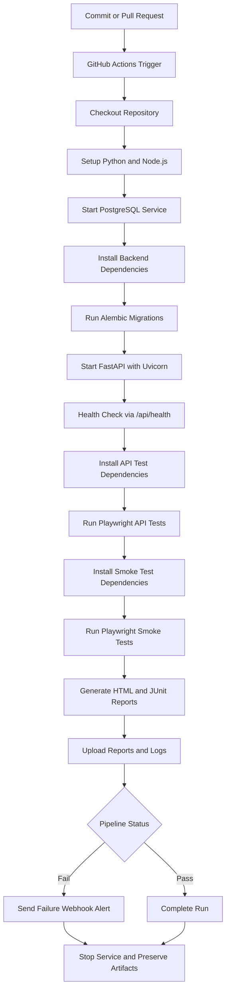

# QA Test Strategy for NovaCart

## 1. Purpose

This document defines the initial QA strategy for **NovaCart**. It describes the testing scope, objectives, test approach, prioritization, tools, and initial deliverables required for baseline quality assurance work.

NovaCart is a demo commerce platform with a FastAPI backend, PostgreSQL persistence, token authentication, and a React frontend served by the same application. The strategy in this document is based on the current repository structure and publicly documented features. :contentReference[oaicite:5]{index=5}

## 2. Test Objectives

The main objectives of the initial QA phase are:

- Validate the most critical customer and admin workflows
- Prioritize test execution based on business risk
- Establish a reproducible QA environment
- Create a baseline set of manual and automated smoke tests
- Produce evidence and metrics for future research and reporting

## 3. Scope

### 3.1 In Scope

The following features are included in the initial QA scope:

- User registration and login
- Token-based session validation
- Product catalog browsing
- Filtering and sorting of products
- Product details and review retrieval
- Review submission
- Cart operations
- Coupon application and removal
- Shipping method selection
- Checkout and order creation
- Order history and order details
- Admin dashboard access
- Admin product creation, update, and deletion
- Order status updates
- Health and metrics endpoints

These areas are supported by the API endpoints listed in the repository README. :contentReference[oaicite:6]{index=6}

### 3.2 Out of Scope

The following areas are excluded from this initial assignment phase:

- Full performance and load testing
- Penetration testing
- Deep cross-browser compatibility testing
- Production deployment validation
- Accessibility certification
- External third-party payment processing validation

## 4. Risk-Based Prioritization

Testing will be prioritized according to the risk assessment.

### Priority 1
- Authentication
- Shopping cart
- Checkout and order creation

### Priority 2
- Admin product management
- Order status updates
- Database persistence validation

### Priority 3
- Product catalog
- Product details
- Product reviews
- Order history
- Admin dashboard

### Priority 4
- Health endpoint
- Metrics endpoint

This order ensures that the highest business-impact workflows are tested first.

## 5. Test Approach

## 5.1 Manual Testing

Manual testing will be used for:

- Exploratory testing of the main user interface
- Validation of complete user flows
- Negative form scenarios
- Role-based access checks
- Basic visual verification of major pages
- Admin versus non-admin behavior comparison

## 5.2 Automated Testing

Automated testing will be introduced through:

- **Postman** for API smoke testing
- **Playwright** for UI smoke testing
- **GitHub Actions** for basic repeatable QA checks in CI

Initial automation is intentionally small and focused on the highest-priority flows.

## 5.3 Automation Approach & Tool Selection

Automation follows a risk-based strategy first, then expands into repeatable regression coverage and selected end-to-end validation. The highest-priority business paths are automated before lower-risk utility features, with the first focus placed on authentication, cart behavior, checkout, order creation, admin product control, and database-backed transaction integrity. Once those flows are stable, the same suite acts as a regression safety net in CI, while the browser smoke layer confirms that the deployed UI can still execute core user journeys against the running application.

The primary automation framework is **Playwright**. It is used in two ways in this repository: direct API automation under [`tests/`](/Users/marioscordia/Desktop/qualityassurance/tests) and browser smoke coverage under [`postman/`](/Users/marioscordia/Desktop/qualityassurance/postman). Playwright was selected because it supports both API and browser testing in one ecosystem, produces HTML and JSON/JUnit-friendly reports, integrates cleanly with GitHub Actions, and reduces framework sprawl for a project that needs fast setup and maintainable evidence collection. As an alternative, **Postman/Newman** could cover API regression effectively, but it is less suitable when the suite needs shared TypeScript helpers, richer assertion logic, tighter source control over test code, and a direct path from API checks to browser-based end-to-end coverage. For browser automation, **Cypress** is a reasonable alternative, but Playwright is a better fit here because the project already uses it successfully for API tests and because its headless CI support, parallel execution model, and unified reporting simplify maintenance.

The automation scope covers the high-risk and medium-risk modules already identified in the risk assessment: authentication, authorization, cart operations, coupon and shipping logic, checkout and order creation, order management, inventory behavior, admin product CRUD, pricing validation, database transaction behavior, health checks, input validation, and browser smoke coverage for the customer and admin interface. This keeps automation aligned with the areas most likely to cause revenue loss, broken customer journeys, or administrative control failures.

Scripts are kept modular and reusable through a helper-based design. Shared request behavior is centralized in [`tests/helpers/api-client.ts`](/Users/marioscordia/Desktop/qualityassurance/tests/helpers/api-client.ts), which wraps Playwright's `APIRequestContext` and standardizes authentication, request construction, and common actions such as login, cart setup, and product creation. Reusable factories and seed references are centralized in [`tests/helpers/test-data.ts`](/Users/marioscordia/Desktop/qualityassurance/tests/helpers/test-data.ts) so that test data remains unique, deterministic, and easy to update. Test specs are grouped by module folder, which keeps failures traceable to business areas and supports selective regression execution. For the browser layer, the same modular principle should continue through a Page Object Model or equivalent page abstraction as UI coverage expands beyond smoke testing, so selectors and page actions stay isolated from test intent and can be updated without rewriting every scenario.

## 5.4 Test Levels

### API-Level Testing
The API layer will be validated through direct endpoint testing. Key areas include:

- Authentication endpoints
- Product endpoints
- Cart endpoints
- Order endpoints
- Admin endpoints
- Health and metrics endpoints

### UI-Level Testing
The UI layer will be validated for:

- Home page access
- Login workflow
- Product browsing
- Cart interaction
- Admin dashboard access

### Integration-Level Testing
Initial integration checks will verify:

- Frontend to backend communication
- Backend to PostgreSQL persistence
- Cart to order transition
- Admin operations affecting stored data

## 6. Initial Test Types

The following test types are included in this phase:

- Smoke testing
- Functional testing
- Basic negative testing
- Basic authorization testing
- Basic integration testing

Optional future extension:
- Broader regression testing
- Load testing
- Expanded API automation
- Security-oriented checks

## 7. Entry Criteria

Testing may begin when the following conditions are met:

- The repository is cloned successfully
- Python dependencies are installed
- PostgreSQL is running through Docker Compose
- `.env` is created from `.env.example`
- Alembic migrations run successfully
- The FastAPI application starts successfully
- The application is accessible at `http://127.0.0.1:8000`
- Seeded users are available for login
- `/api/health` responds successfully :contentReference[oaicite:7]{index=7}

## 8. Exit Criteria

The initial QA phase is considered complete when:

- High-risk modules have been reviewed
- Core smoke scenarios have been executed
- Initial defects have been documented
- Baseline metrics have been collected
- Supporting screenshots are stored
- QA documents are completed
- Basic CI validation has been prepared

## 9. Quality Gate Definitions

The following quality gates define the minimum conditions required for the automated suite to be considered release-ready. Observed results are taken from the existing evidence set, including the coverage analysis, execution-time summary, and saved test results; no tests were rerun for this section.

| Quality Gate ID | Metric | Threshold | Observed Results | Notes |
|---|---|---|---|---|
| QG-001 | Automation coverage across high-risk functions | `>= 80%` | `92%` overall automation coverage (`23/25` high-risk functions automated) | Pass. The suite exceeds the minimum threshold, but coupon removal and explicit migration validation remain uncovered. |
| QG-002 | Critical defects in release candidate | `0` allowed | Not met; unresolved failures remain in critical-path modules, including authentication and checkout-related coverage | Fail. Severity was not formally labeled in the saved artifacts, so this gate is interpreted conservatively from critical workflow failures and remains blocked pending triage and fix validation. |
| QG-003 | Test execution time per module | `<= 10 minutes/module` | Slowest observed module was `System/Admin` at `1.195 sec` total | Pass. Current execution time is well below the limit and is suitable for CI feedback. |
| QG-004 | Regression success rate | `100%` pass with `0` failed tests | Full API suite: `37 passed`, `20 failed`, `53 did not run`; browser smoke suite: `10/10 passed` | Fail. The browser smoke layer passed, but the main API regression suite did not meet release criteria. |
| QG-005 | Linting and static analysis | `100%` pass with `0` high-severity findings | No recorded linting or static-analysis evidence in the current artifact set | Fail. The gate cannot be approved without a dedicated lint/static-analysis stage and preserved results. |

QG-001 passed because the observed automation coverage is above the required minimum. The follow-up action was to record the remaining gaps and keep coupon removal and explicit migration verification on the backlog for the next expansion of the suite.

QG-002 failed because the current evidence still shows unresolved failures in business-critical workflows. The action taken was to block release readiness, retain the defects in the evidence log, and require defect triage to distinguish product defects from automation issues before retesting.

QG-003 passed because every observed module completed far below the ten-minute limit. The action taken was to keep the current runtime as an acceptable baseline while noting that the System/Admin module is still the slowest candidate for future optimization.

QG-004 failed because the approved regression baseline requires a clean run, and the saved API suite results do not meet that standard. The action taken was to treat the overall regression gate as failed even though the smoke layer passed, and to require fixes plus a clean rerun before considering the suite stable.

QG-005 failed because there is no recorded evidence that linting or static analysis was executed. The action taken was to define this as a mandatory CI gap: a lint/static-analysis stage must be added to the pipeline and its results must be published as build artifacts before the gate can pass.

## 10. Tools

The following tools are recommended for the QA setup:

- **Postman** for API endpoint testing
- **Playwright** for browser-based smoke testing
- **Docker Compose** for local PostgreSQL environment
- **Alembic** for schema migration and seed setup
- **GitHub Actions** for a basic CI pipeline

These tools are suitable for a modern web application and can be set up quickly for initial QA work.

## 11. CI/CD Integration Overview

The CI/CD implementation for NovaCart is defined in [`github-actions-ci.yml`](/Users/marioscordia/Desktop/qualityassurance/github-actions-ci.yml) and is intended for GitHub Actions execution once placed under `.github/workflows/`. The pipeline is triggered on `push` to `main` or `master`, on every `pull_request`, and manually through `workflow_dispatch`. Its role is to create a clean environment, start the application, run the automated suites, publish reports, and send an alert if the run fails.

The pipeline runs in the following order:

1. The workflow checks out the repository using `actions/checkout@v4`.
2. It provisions Python `3.13` with `actions/setup-python@v5` for the FastAPI backend, migrations, and database tooling.
3. It provisions Node.js `20` with `actions/setup-node@v4` and enables npm caching for the API and smoke-test workspaces.
4. It starts a PostgreSQL service container and exposes the CI database to the application through `DATABASE_URL`.
5. It installs backend dependencies from `requirements.txt` and runs `alembic upgrade head` to create the expected schema.
6. It starts the FastAPI service with Uvicorn in the background and records server output to `uvicorn.log`.
7. It polls `/api/health` with `curl` to confirm the application is ready before any tests begin.
8. It installs the API test dependencies in [`tests/`](/Users/marioscordia/Desktop/qualityassurance/tests) and executes the Playwright API suite with HTML and JUnit XML reporting enabled.
9. It installs the browser smoke test dependencies in [`postman/`](/Users/marioscordia/Desktop/qualityassurance/postman), installs Chromium, and executes the Playwright smoke suite with HTML and JUnit XML reporting enabled.
10. It uploads API reports, smoke reports, and server logs as workflow artifacts so evidence is preserved even when the run fails.
11. If the workflow fails and `FAILURE_WEBHOOK_URL` is configured, it sends a webhook alert to the selected team channel.
12. It stops the background API process before the job exits.

The toolchain used in this pipeline is GitHub Actions for orchestration, PostgreSQL as the service dependency, Alembic for schema migration, Uvicorn for application startup, Playwright for API and browser automation, `curl` for health validation and alert delivery, and GitHub artifact uploads for evidence retention. A concise step-by-step summary is also preserved in [`CI_CD_PIPELINE_TABLE.md`](/Users/marioscordia/Desktop/qualityassurance/evidence/CI_CD_PIPELINE_TABLE.md).

No dedicated CI screenshots were captured in the current evidence set. For visual documentation, this strategy references the workflow file and pipeline table above and embeds the execution flow below as a Mermaid diagram.

## 12. Initial Smoke Coverage Plan

The initial smoke suite should cover:

### Authentication
- Valid login
- Invalid login
- Protected endpoint without token
- Admin-only endpoint access control

### Product Area
- Product list retrieval
- Featured product retrieval
- Category retrieval
- Product details access

### Cart and Checkout
- Add item to cart
- Update cart item quantity
- Remove item from cart
- Apply coupon
- Set shipping method
- Create order

### Orders
- Get user orders
- Get order details

### Admin
- Admin login
- Admin dashboard access
- Create product
- Update product
- Delete product
- Update order status

### Technical Endpoints
- Health endpoint
- Metrics endpoint

## 13. Initial Results & Coverage Metrics

The initial automation evidence shows that the project already has broad coverage across the highest-risk backend workflows, but the current baseline is not yet a clean regression signal because several API modules still fail. The summary below consolidates the saved coverage analysis, execution-time data, and defect comparison into one reporting view.

| Module/Feature | Automated? | Coverage % | Execution Time (sec) | Defects Found | Pass/Fail | Notes |
|---|---|---:|---:|---:|---|---|
| Authentication | Yes | 100 | 1.036 | 6 | Fail | Fully automated, but defects exceeded expected range and blocked clean regression readiness. |
| Shopping Cart | Yes | 86 | 0.421 | 3 | Pass | Core cart behavior is automated; coupon removal remains uncovered and some failures were influenced by setup instability. |
| Coupon Handling | Partially | 86 | 0.421 | 1 | Pass | Coupon application is covered, but direct coupon-removal automation is still missing. |
| Shipping Selection | Yes | 86 | 0.421 | 1 | Pass | Shipping tests exist, although saved failures were tied to upstream registration/setup problems. |
| Checkout and Order Creation | Yes | 100 | 0.571 | 2 | Pass | Critical transaction flow is automated, but one observed failure was linked to test implementation rather than confirmed product behavior. |
| Order History and Order Details | Yes | 100 | 0.571 | 1 | Pass | Covered within the orders module; execution time is shared with the broader order suite. |
| Order Status Updates | Yes | 100 | 0.571 | 0 | Pass | Admin status-change coverage exists and no failing status-update case was recorded in the saved run. |
| Admin Product Management | Yes | 100 | 0.463 | 1 | Pass | CRUD coverage is complete, though an early failure limited downstream execution in the saved product run. |
| Admin Dashboard | Yes | Not separately measured | 1.195 | 2 | Fail | Dashboard checks are automated within the system/admin run and exceeded expected defect count. |
| Product Catalog and Search/Filter | Yes | Not separately measured | 0.463 | 0 | Pass | Automated in the products suite; no defect was recorded in the saved evidence. |
| Product Details | Yes | Not separately measured | 0.463 | 0 | Pass | Product-detail coverage exists through the products module and no failure was observed. |
| Product Reviews | Yes | Not separately measured | 0.463 | 1 | Pass | Review/rating behavior is automated but one recalculation defect was captured. |
| Database Migration and Persistence | Partially | 80 | 1.195 | 1 | Pass | Transaction integrity is covered, but explicit migration validation is still operational rather than test-script based. |
| Health Endpoint | Yes | Not separately measured | 1.195 | 0 | Pass | Health coverage is present in the system suite and the saved results were clean. |
| Metrics Endpoint | Yes | Not separately measured | 1.195 | 0 | Pass | Metrics checks are automated and no defect was recorded in the saved system evidence. |
| Frontend Delivery and UI Integration | Yes | Smoke only | Not captured in current timing summary | 0 | Pass | The saved browser smoke suite passed `10/10`, confirming basic UI availability and core journey continuity. |

What worked well is the overall breadth of automation: high-risk-function coverage reached `92%`, the critical API modules are already represented in code, and execution times are short enough to support CI use without slowing development feedback. The browser smoke suite also passed completely, which is useful as a lightweight confirmation that the deployed UI and routing remain functional even when deeper API regression is unstable.

What still needs improvement is the reliability and completeness of the backend regression layer. Authentication and Admin Dashboard exceeded expected defect levels, coupon removal and explicit migration validation are still uncovered, and some recorded failures were caused by automation issues such as fixture misuse rather than product behavior alone. That means the current suite is strong enough for defect discovery and trend reporting, but not yet strong enough to serve as a fully trusted release gate without defect triage and cleanup.

For the research paper, these results provide a useful evidence base: they show that a risk-based automation strategy achieved broad coverage quickly, surfaced meaningful failures in the most important workflows, and produced measurable metrics for coverage, runtime, and defect concentration. They also support a balanced conclusion that automation improved visibility and repeatability, while highlighting the practical limitation that automated suites themselves require maintenance before they can function as a stable regression oracle.

## 14. Deliverables

The output of the initial QA phase will include:

- Risk assessment document
- Test strategy document
- QA environment setup report
- Baseline metrics summary
- Postman collection
- Playwright smoke tests
- CI workflow configuration
- Screenshots and supporting evidence

## 15. Conclusion

The NovaCart QA strategy uses a risk-based approach to direct limited testing effort toward the most business-critical modules. Initial work will focus on authentication, transaction flow, and administrative control. This strategy is appropriate for a first QA assignment because it creates a practical baseline for later expansion into regression, performance, and research-oriented testing.
